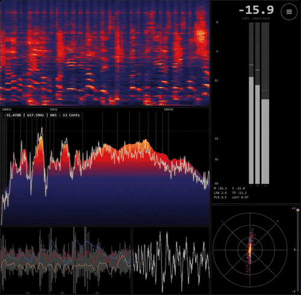

# RealMeters

A full-screen, mastering-style audio-metering visualizer for Spotify. It shows the **real
output signal** — not Spotify's precomputed analysis — in a compact layout: spectrogram,
spectrum, waveform, oscilloscope, stereometer and LUFS / true-peak.

The numbers are real: a −20 dBFS tone reads −20.00 LUFS / −19.99 dBTP.

## Install (one click, from Spotify)

1. Install the [Spicetify Marketplace](https://github.com/spicetify/marketplace) if you don't
   have it.
2. Open **Marketplace → Extensions**, search **RealMeters**, and click **Install**.
3. Click the **RealMeters** button (the bars icon) in the now-playing bar to open the
   full-screen meters. Press **Esc** or **Close** to exit.

## You need the bridge running

A Spicetify extension is sandboxed JavaScript inside Spotify — it **cannot capture system
audio by itself**. The measurements come from a small local companion,
**[minimeters-bridge](https://github.com/Manuel-1312/minimeters-bridge)**, which captures the
default Windows output through WASAPI loopback and streams them on `ws://127.0.0.1:8985`.

Install it once (Windows, no admin needed): download the
[latest release](https://github.com/Manuel-1312/minimeters-bridge/releases/latest), extract,
and double-click **`Install MiniMeters Bridge.bat`**. Until it is running, the view shows
*bridge offline*. Because the bridge uses WASAPI loopback, this is **Windows only** for now.

Prefer a dedicated sidebar page (custom app)?

The same visuals are also available as a Spicetify **custom app** (its own page in the left
sidebar) built from `src/`. Copy the app into `%APPDATA%\spicetify\CustomApps\realmeters\`:

**Prebuilt (no Node needed):** download this repo and copy its `dist/` folder there, then:

    spicetify config custom_apps realmeters
    spicetify apply

**From source:**

    npm install
    npm run build
    # copy dist/ into %APPDATA%\spicetify\CustomApps\realmeters\
    spicetify config custom_apps realmeters
    spicetify apply

Then open **RealMeters** from the left sidebar.

## Notes
- Independent, unofficial project. The mastering-style layout is inspired by the
  [MiniMeters](https://minimeters.app) desktop app; RealMeters is not affiliated with or
  endorsed by it.
- The visualizer renders at the browser refresh rate; the analysis and the spectrogram scroll
  run at the bridge frame rate (144 fps by default).

## License
MIT — see [LICENSE](LICENSE).
